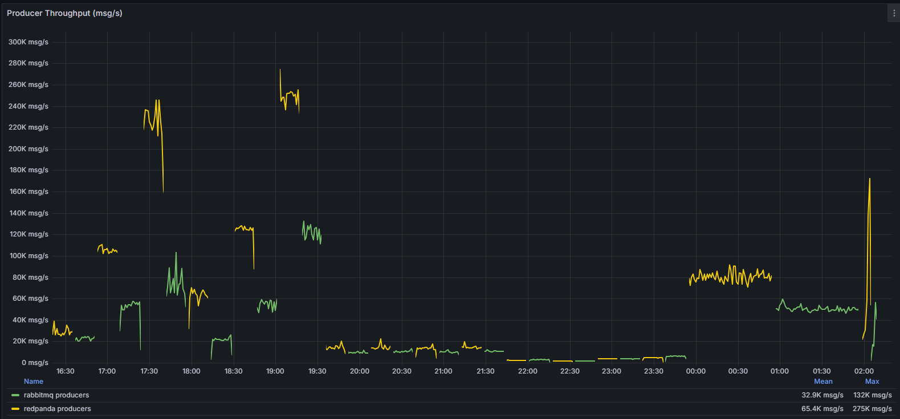
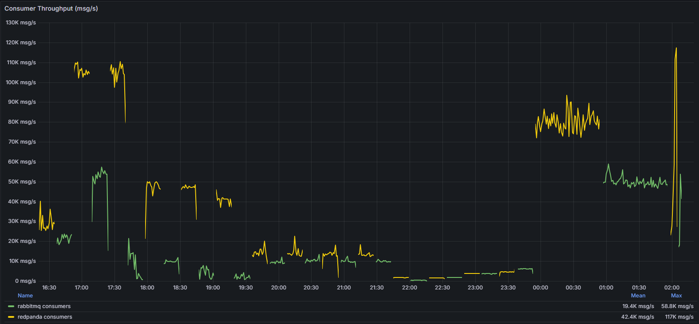
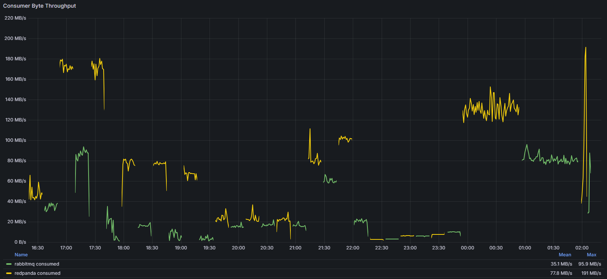
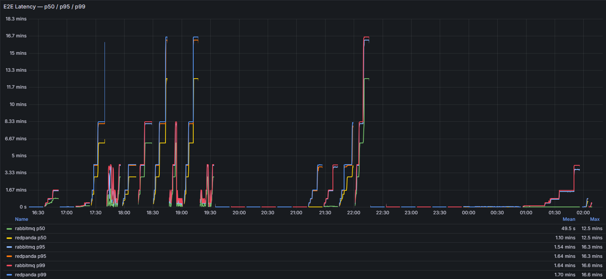
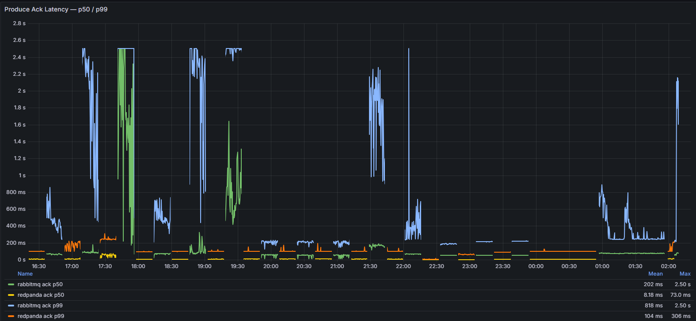
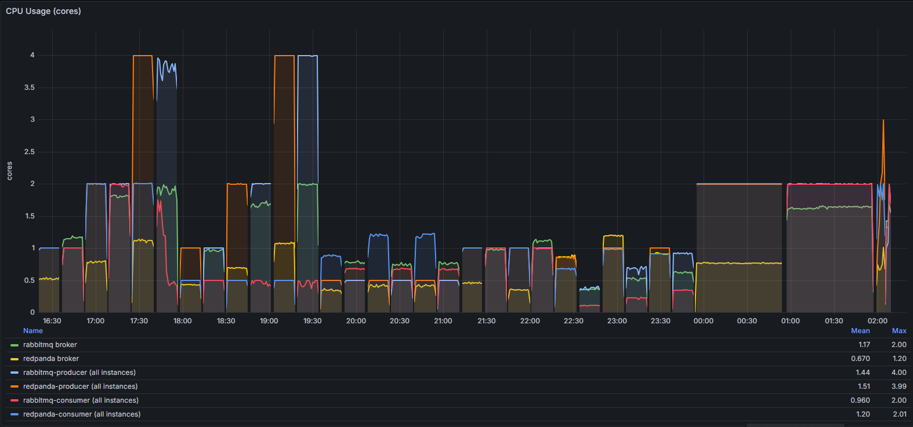
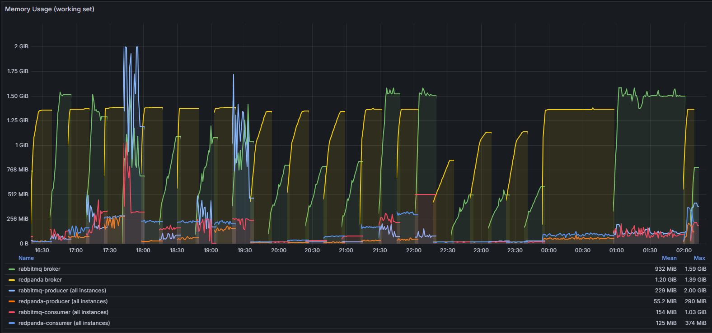

# Benchmark Report — Redpanda vs RabbitMQ SuperStreams

**Run date:** 2026-02-20 16:19 UTC → 2026-02-21 02:09 UTC
**Testplan:** [`testplan.json`](./testplan.json)
**Metrics source:** Prometheus at `localhost:9090` (Grafana: `localhost:3000/d/broker-benchmark`)

---

## Environment

| Parameter | Value |
|-----------|-------|
| Broker CPU limit | 2.0 cores |
| Broker memory limit | 2 GB |
| Producer CPU limit | 0.5 cores each |
| Producer memory limit | 256 MB each |
| Consumer CPU limit | 0.5 cores each |
| Consumer memory limit | 256 MB each |
| Partitions | 8 |
| Default message size | 256 B |

All tests ran sequentially with 60 s cooldown (120 s for soak tests) between each run.
CPU figures below are in **core-% units** (100% = 1 core; 200% = 2 cores fully utilised).

---

## 1. Throughput

### Results
Producer throughput msg/s

Consumer throughput msg/s

Producer throughput bytes

Consumer throughput bytes

### 1.1 Group A — Symmetric Scaling (N producers : N consumers, 256 B, unlimited rate)

| Test | Config | Broker | Avg msg/s | Avg MB/s |
|------|--------|--------|----------:|--------:|
| A1_RP  | 2p : 2c | Redpanda | 29,401 | 6.9 |
| A1_RMQ | 2p : 2c | RabbitMQ | 22,274 | 5.3 |
| A2_RP  | 4p : 4c | Redpanda | 104,025 | 24.5 |
| A2_RMQ | 4p : 4c | RabbitMQ | 52,833 | 12.4 |
| A3_RP  | 8p : 8c | Redpanda | 219,567 | 51.6 |
| A3_RMQ | 8p : 8c | RabbitMQ | 72,086 | 16.9 |

**Observations:**
- Redpanda scales near-linearly from 2p→4p→8p (29K → 104K → 219K, i.e. ~3.5× and ~7.5× baseline). RabbitMQ scales sub-linearly (22K → 52K → 72K, i.e. ~2.4× and ~3.2×).
- At 8p:8c, Redpanda delivers **3× the throughput** of RabbitMQ under identical resource constraints.
- RabbitMQ broker hits ~188% CPU at 8p:8c (94% of its 2-core budget) while Redpanda peaks at ~110%.

---

### 1.2 Group B — Producer-Heavy (N producers : 1 consumer, 256 B, unlimited rate)

| Test | Config | Broker | Avg msg/s | Avg MB/s |
|------|--------|--------|----------:|--------:|
| B1_RP  | 2p : 1c | Redpanda | 61,490 | 14.5 |
| B1_RMQ | 2p : 1c | RabbitMQ | 22,609 | 5.3 |
| B2_RP  | 4p : 1c | Redpanda | 121,688 | 28.1 |
| B2_RMQ | 4p : 1c | RabbitMQ | 52,922 | 12.2 |
| B3_RP  | 8p : 1c | Redpanda | 244,097 | 56.3 |
| B3_RMQ | 8p : 1c | RabbitMQ | 119,187 | 27.3 |

**Observations:**
- Having only 1 consumer does not throttle producer throughput — both brokers continue to accumulate a growing backlog. Produced msg/s is maintained but E2E latency grows unboundedly (see §2).
- Redpanda B3 peaks at 244K msg/s — the highest throughput in the entire suite — at only ~106% broker CPU.
- RabbitMQ B3 reaches 119K msg/s, ~2× its B1 baseline, suggesting RabbitMQ benefits more from fewer consumers competing for acks.

---

### 1.3 Group C — Consumer-Heavy (1 producer : N consumers, 256 B, unlimited rate)

| Test | Config | Broker | Avg msg/s | Avg MB/s |
|------|--------|--------|----------:|--------:|
| C1_RP  | 1p : 2c | Redpanda | 14,449 | 3.4 |
| C1_RMQ | 1p : 2c | RabbitMQ | 9,978 | 2.3 |
| C2_RP  | 1p : 4c | Redpanda | 15,070 | 3.5 |
| C2_RMQ | 1p : 4c | RabbitMQ | 10,266 | 2.4 |
| C3_RP  | 1p : 8c | Redpanda | 14,072 | 3.3 |
| C3_RMQ | 1p : 8c | RabbitMQ | 10,826 | 2.5 |

**Observations:**
- Throughput is bottlenecked at the single producer (capped at 0.5 cores). Adding more consumers provides no benefit.
- Redpanda is ~40% faster than RabbitMQ even at 1 producer, indicating lower per-message overhead on the broker path.
- Throughput remains stable across C1→C3 — confirming the single producer ceiling.

---

### 1.4 Message Size Variation (2p : 2c, unlimited rate)

| Test | Msg Size | Broker | Avg msg/s | Avg MB/s |
|------|----------|--------|----------:|--------:|
| A1_RP      | 256 B  | Redpanda | 29,401 | 6.9 |
| A1_RMQ     | 256 B  | RabbitMQ | 22,274 | 5.2 |
| SIZE1K_RP  | 1 KB   | Redpanda | 14,597 | 13.9 |
| SIZE1K_RMQ | 1 KB   | RabbitMQ | 10,789 | 10.3 |
| SIZE10K_RP | 10 KB  | Redpanda | 2,164  | 20.6 |
| SIZE10K_RMQ| 10 KB  | RabbitMQ | 2,907  | 27.7 |

**Observations:**
- Both brokers decrease msg/s as message size increases (larger serialisation, network, and disk overhead).
- At 10 KB, RabbitMQ slightly outpaces Redpanda in **msg/s** (2,907 vs 2,164), though both are far below the 256 B baseline. The drivers differ: RP producers are CPU-saturated; RMQ broker consumes ~110% CPU.
- Byte throughput continues to climb with size for both, hitting ~21 MB/s (RP) and ~28 MB/s (RMQ) at 10 KB — both well below their peaks in the multi-producer tests.

---

### 1.5 Rate-Limited Tests (2p : 2c, 256 B, N msg/s per producer)

| Test | Target (total) | Broker | Achieved msg/s | Efficiency |
|------|---------------|--------|---------------:|-----------:|
| RATE1K_RP  | 2,000 | Redpanda | 1,564 | 78% |
| RATE1K_RMQ | 2,000 | RabbitMQ | 1,783 | 89% |
| RATE5K_RP  | 10,000 | Redpanda | 3,698 | 37% |
| RATE5K_RMQ | 10,000 | RabbitMQ | 3,647 | 36% |
| RATE10K_RP | 20,000 | Redpanda | 4,528 | 23% |
| RATE10K_RMQ| 20,000 | RabbitMQ | 6,034 | 30% |

**Observations:**
- At 1K/s/producer both brokers stay below target. The ~11–22% shortfall likely reflects time-averaging across startup and rate-limiter warm-up.
- At 5K and 10K/s, **producer CPU is the binding constraint** (both hit ~99% CPU per producer). Neither broker achieves the target; throughput plateaus.
- Under equal CPU load, RabbitMQ delivers slightly higher msg/s at high rates — but at significantly worse latency (see §2.3).

---

### 1.6 Soak Tests (4p : 4c, 256 B, 60 minutes, unlimited rate)

| Test | Broker | Avg msg/s | Avg MB/s |
|------|--------|----------:|--------:|
| SOAK_RP  | Redpanda | 81,151 | 18.8 |
| SOAK_RMQ | RabbitMQ | 51,488 | 11.9 |

**Observations:**
- Redpanda sustains 57% higher throughput than RabbitMQ over the full 60-minute window, consistent with A2 results.
- No errors were recorded on either broker.

---

### 1.7 Ramp-Up Tests (4 consumers, producers step 2→64, 2-min steps)

| Test | Broker | Step | Producers | Throughput | P99 Latency | Result |
|------|--------|------|----------:|-----------:|------------:|--------|
| RAMP_RP | Redpanda | 0 | 2 | 27,604 msg/s | 208 ms | OK |
| RAMP_RP | Redpanda | 1 | 4 | 71,149 msg/s | 977 ms | OK |
| RAMP_RP | Redpanda | 2 | 6 | 178,798 msg/s | 49.5 s | **ABORT** |
| RAMP_RMQ | RabbitMQ | 0 | 2 | 18,766 msg/s | 238 ms | OK |
| RAMP_RMQ | RabbitMQ | 1 | 4 | 56,378 msg/s | 24.1 s | **ABORT** |

**Observations:**
- Redpanda sustains healthy latency (p99 < 1 s) up to 4 producers, then breaches the 10 s abort threshold at 6 producers.
- RabbitMQ breaches the threshold already at 4 producers, with p99=24 s.
- **Saturation point:** Redpanda ~71K msg/s (clean), RabbitMQ ~19K msg/s (clean). Redpanda tolerates ~3.7× more load before latency degrades.

---

## 2. End-to-End Latency

E2E latency is measured from message timestamp embedded at produce time to receipt at consumer. Values represent time-averaged quantiles over the test window.

### Results
Latency E2E

Latency Producer to Ack

### 2.1 Group A — Symmetric Scaling

| Test | Broker | P50 (ms) | P95 (ms) | P99 (ms) | Ack P99 (ms) |
|------|--------|--------:|--------:|--------:|-------------:|
| A1_RP  | Redpanda | 39 | 202 | 241 | 99 |
| A1_RMQ | RabbitMQ | 30,989 | 58,366 | 61,582 | 478 |
| A2_RP  | Redpanda | 341 | 812 | 1,026 | 170 |
| A2_RMQ | RabbitMQ | 3,554 | 10,235 | 12,737 | 1,960 |
| A3_RP  | Redpanda | 241,104 | 335,802 | 347,293 | 243 |
| A3_RMQ | RabbitMQ | 40,603 | 110,420 | 146,513 | 2,500 |

**Observations:**
- **A1:** Redpanda is dramatically faster — 39 ms p50 vs 31 **seconds** for RabbitMQ. RabbitMQ's produce ack is slow (478 ms vs 99 ms), indicating the broker is already struggling to handle 22K msg/s with 2 consumers.
- **A2:** Redpanda p50 rises to 341 ms but p99 stays under 1.1 s. RabbitMQ p50 climbs to 3.5 s, p99 to 12.7 s — the consumer pipeline is clearly lagging behind.
- **A3:** At 8p:8c Redpanda E2E latency explodes (p50=241 s) despite produce ack remaining at 243 ms — the broker writes fast but 8 consumers at 0.5 CPU each cannot drain the partitions. RabbitMQ at A3 actually has lower average E2E (40 s p50) because it produces fewer messages, so the queue is relatively smaller.
- **Key insight:** Redpanda's write path is very fast (ack latency stays ~100–250 ms), but with constrained consumer resources the read-side backlog dominates E2E. RabbitMQ's ack latency is 5–10× higher and grows faster with load.

---

### 2.2 Group B — Producer-Heavy

| Test | Broker | P50 (ms) | P95 (ms) | P99 (ms) | Ack P99 (ms) |
|------|--------|--------:|--------:|--------:|-------------:|
| B1_RP  | Redpanda | 118,449 | 171,631 | 176,993 | 96 |
| B1_RMQ | RabbitMQ | 246,009 | 337,912 | 346,249 | 503 |
| B2_RP  | Redpanda | 287,425 | 417,175 | 438,102 | 97 |
| B2_RMQ | RabbitMQ | 72,391 | 140,701 | 154,342 | 2,248 |
| B3_RP  | Redpanda | 415,586 | 545,559 | 557,112 | 99 |
| B3_RMQ | RabbitMQ | 50,402 | 103,802 | 115,285 | 2,492 |

**Observations:**
- With a single consumer the queue backlog grows indefinitely throughout the 15-minute window — E2E latency values here reflect the accumulated backlog depth, not messaging responsiveness.
- Redpanda ack latency stays flat at ~97–99 ms regardless of queue depth, demonstrating write isolation. RabbitMQ ack rises to 503–2,492 ms.
- These tests are primarily useful for understanding **maximum sustainable throughput before backlog forms** rather than for steady-state E2E comparison. Both brokers should ideally be run with matched consumer capacity.

---

### 2.3 Group C — Consumer-Heavy (Low Load, Best-Case Latency)

| Test | Broker | P50 (ms) | P95 (ms) | P99 (ms) | Ack P99 (ms) |
|------|--------|--------:|--------:|--------:|-------------:|
| C1_RP  | 1p:2c | Redpanda | 17 | 92 | 181 | 99 |
| C1_RMQ | 1p:2c | RabbitMQ | 19 | 166 | 233 | 211 |
| C2_RP  | 1p:4c | Redpanda | 14 | 85 | 120 | 99 |
| C2_RMQ | 1p:4c | RabbitMQ | 18 | 171 | 234 | 214 |
| C3_RP  | 1p:8c | Redpanda | 13 | 85 | 112 | 101 |
| C3_RMQ | 1p:8c | RabbitMQ | 17 | 139 | 228 | 204 |

**Observations:**
- These tests reflect the **best-case latency** profile for each broker — load is light enough that no backlog forms.
- Both brokers achieve sub-20 ms p50. Redpanda is slightly faster but the gap is small at low load.
- P99 diverges: Redpanda p99 decreases as consumers are added (181 → 120 → 112 ms), likely due to faster partition fan-out. RabbitMQ p99 remains stable at ~230 ms regardless of consumer count.
- **Under light load Redpanda ack latency is stable at ~100 ms**; RabbitMQ ack is 200–215 ms — suggesting inherent ack overhead.

---

### 2.4 Message Size Tests

| Test | Msg Size | Broker | P50 (ms) | P95 (ms) | P99 (ms) | Ack P99 (ms) |
|------|----------|--------|--------:|--------:|--------:|-------------:|
| A1_RP      | 256 B  | Redpanda | 39 | 202 | 241 | 99 |
| A1_RMQ     | 256 B  | RabbitMQ | 30,989 | 58,366 | 61,582 | 478 |
| SIZE1K_RP  | 1 KB   | Redpanda | 626 | 122,643 | 130,395 | 99 |
| SIZE1K_RMQ | 1 KB   | RabbitMQ | 3,267 | 120,274 | 127,270 | 1,774 |
| SIZE10K_RP | 10 KB  | Redpanda | 116,244 | 197,173 | 206,130 | 99 |
| SIZE10K_RMQ| 10 KB  | RabbitMQ | 417,088 | 580,052 | 604,010 | 458 |

**Observations:**
- At 1 KB, Redpanda p50 is 626 ms vs RabbitMQ 3.3 s — a 5× advantage, consistent with the 256 B baseline.
- At 10 KB, Redpanda p50 is 116 s and RabbitMQ p50 is 417 s. Both are in severe backlog at this message size — the consumer cannot drain 2,000–2,900 × 10 KB = 20–29 MB/s of data with a 0.5-core CPU budget.
- **Ack latency at 10 KB:** Redpanda stays at 99 ms; RabbitMQ is 458 ms. Redpanda's write path is decoupled from message payload size.

---

### 2.5 Rate-Limited Tests

| Test | Target | Broker | P50 (ms) | P95 (ms) | P99 (ms) | Ack P99 (ms) |
|------|--------|--------|--------:|--------:|--------:|-------------:|
| RATE1K_RP  | 2K/s  | Redpanda | 0.78 | 4.3 | 6.6 | 5.2 |
| RATE1K_RMQ | 2K/s  | RabbitMQ | 53 | 98 | 203 | 187 |
| RATE5K_RP  | 10K/s | Redpanda | 1.5 | 7.3 | 21 | 63 |
| RATE5K_RMQ | 10K/s | RabbitMQ | 56 | 120 | 224 | 214 |
| RATE10K_RP | 20K/s | Redpanda | 5.7 | 41 | 52 | 89 |
| RATE10K_RMQ| 20K/s | RabbitMQ | 53 | 131 | 226 | 220 |

**Observations:**
- These tests are the most informative for comparing **message pipeline latency under sustainable load**, since neither broker is overwhelmed.
- At 2K msg/s (RATE1K), Redpanda achieves **sub-millisecond p50 (0.78 ms)**, while RabbitMQ is 53 ms — a 68× difference. The RabbitMQ figure is consistent across all rate tests, suggesting a floor of ~50 ms due to batch flushing / flow control behaviour in the stream client.
- Redpanda p99 scales gently: 6.6 ms → 21 ms → 52 ms as load triples. RabbitMQ p99 is flat at ~200–225 ms — indicating a steady-state overhead, not proportional response to load.
- **For latency-sensitive workloads Redpanda is the clear choice**, even when throughput is not the binding constraint.

---

### 2.6 Soak Tests (60 minutes)

| Test | Broker | P50 (ms) | P95 (ms) | P99 (ms) | Ack P99 (ms) |
|------|--------|--------:|--------:|--------:|-------------:|
| SOAK_RP  | Redpanda | 90 | 1,080 | 1,772 | 98 |
| SOAK_RMQ | RabbitMQ | 167 | 56,656 | 62,921 | 337 |

**Observations:**
- Redpanda maintains steady p50 (90 ms) throughout the 60-minute window; p99 at 1.8 s is consistent with a small sustained backlog at 4p:4c.
- RabbitMQ's p95/p99 (57 s / 63 s) indicates ongoing queue growth over the soak period — the consumer pipeline gradually falls behind, likely due to higher per-message overhead accumulating over time.
- Redpanda ack latency holds at 98 ms throughout; RabbitMQ ack at 337 ms confirms increased pressure on the broker.

---

## 3. CPU Usage

CPU is in core-% units (100 = 1 core; broker budget = 200).

### Results
CPU Usage

### 3.1 Broker CPU

| Test | Redpanda (%) | RabbitMQ (%) |
|------|-------------:|-------------:|
| A1 (2p:2c)  | 51  | 115 |
| A2 (4p:4c)  | 78  | 177 |
| A3 (8p:8c)  | 110 | 188 |
| B1 (2p:1c)  | 43  | 96  |
| B2 (4p:1c)  | 68  | 164 |
| B3 (8p:1c)  | 106 | 195 |
| C1 (1p:2c)  | 34  | 76  |
| C2 (1p:4c)  | 41  | 74  |
| C3 (1p:8c)  | 41  | 76  |
| SIZE1K      | 45  | 97  |
| SIZE10K     | 35  | 110 |
| RATE1K      | 86  | 36  |
| RATE5K      | 118 | 53  |
| RATE10K     | 90  | 62  |
| SOAK        | 76  | 163 |

**Observations:**
- RabbitMQ consistently uses **2–2.5× more broker CPU** than Redpanda at equivalent load, hitting 95–100% of its 2-core budget at 8-producer tests. Redpanda rarely exceeds 55% of budget in the unlimited tests.
- Exception: **rate-limited tests** (RATE1K/5K/10K) show Redpanda using *more* broker CPU than RabbitMQ. At low message rates, Redpanda's Kafka-compatible overhead (replication, metadata, partition leadership) consumes a constant baseline even with little data. RabbitMQ is more idle at low load.
- Redpanda has more CPU headroom remaining at saturation, suggesting further scaling is possible with additional cores.

### 3.2 Producer & Consumer CPU

| Test | RP Prod (%) | RP Cons (%) | RMQ Prod (%) | RMQ Cons (%) |
|------|----------:|----------:|----------:|----------:|
| A1 (2p:2c) | 97  | 97  | 99  | 99  |
| A2 (4p:4c) | 198 | 198 | 194 | 192 |
| A3 (8p:8c) | 394 | 198 | 376 | 93  |
| B3 (8p:1c) | 395 | 49  | 390 | 45  |
| C3 (1p:8c) | 49  | 118 | 49  | 66  |
| SOAK (4p:4c)| 199 | 199 | 199 | 199 |

**Observations:**
- Producers are CPU-saturated in all unlimited-rate tests — each instance hits its 0.5-core cap.
- **A3_RMQ consumer CPU is only 93%** (vs 198% for RP) despite lower throughput — RabbitMQ consumers are not compute-limited but likely waiting on broker responses.
- Consumer CPU is the latency bottleneck in A3_RP: consumers are at 198% (capped at 2× 0.5 cores for 8 consumers, meaning all 8 are saturated with just 2 cores total), causing the E2E latency explosion.

---

## 4. Memory Usage

### Results
Memory Usage

### 4.1 Broker Memory

| Test | Redpanda (MB) | RabbitMQ (MB) |
|------|-------------:|-------------:|
| A1 (2p:2c)  | 1,176 | 1,118 |
| A2 (4p:4c)  | 1,381 | 1,176 |
| A3 (8p:8c)  | 1,410 | 1,173 |
| B3 (8p:1c)  | 1,411 | 931  |
| C1 (1p:2c)  | 1,078 | 517  |
| SIZE10K     | 1,328 | 1,378 |
| RATE1K      | 655  | 307  |
| SOAK        | 1,386 | 1,483 |

**Observations:**
- Redpanda maintains a **relatively stable memory footprint (~1.1–1.4 GB)** across most tests — the working set is dominated by in-memory segment buffers. Memory does not grow proportionally with producer count.
- RabbitMQ memory varies more widely: ~300 MB at low load (RATE1K) up to ~1.5 GB during the SOAK test. Under queue backlog (B series, SIZE10K) RabbitMQ memory is lower than Redpanda, consistent with RabbitMQ offloading queued messages to disk earlier.

### 4.2 Client (Producer + Consumer) Memory

| Test | RP Prod (MB) | RP Cons (MB) | RMQ Prod (MB) | RMQ Cons (MB) |
|------|----------:|----------:|----------:|----------:|
| A1 (2p:2c) | 26   | 23   | 58   | 109  |
| A2 (4p:4c) | 71   | 160  | 246  | 142  |
| A3 (8p:8c) | 227  | 280  | 1,686 | 596 |
| B3 (8p:1c) | 148  | 227  | 1,122 | 222 |
| SOAK (4p:4c)| 55  | 96   | 121  | 103  |

**Observations:**
- **A3_RMQ producers consume 1,686 MB total** for 8 instances (~211 MB each), more than 7× the equivalent RP producers (~28 MB each). This is a significant concern for multi-instance deployments.
- The RabbitMQ stream Go client (`rabbitmq-stream-go-client v1.4.4`) appears to buffer substantially more data per producer instance, possibly due to per-partition connection state and internal confirm buffers.
- Redpanda clients (franz-go) are memory-efficient and well within the 256 MB per-container budget. RabbitMQ producers regularly approach or exceed the budget at 8 instances.

---

## 5. Conclusions

### 5.1 Throughput

| Scenario | Winner | Delta |
|----------|--------|-------|
| Symmetric scaling (A series) | **Redpanda** | 1.3–3× at all concurrency levels |
| Producer-heavy (B series) | **Redpanda** | 2.7–3× (though both produce backlogs) |
| Consumer-heavy (C series) | **Redpanda** | ~40% (single-producer bottleneck) |
| Large messages (10 KB) | **RabbitMQ** | +34% msg/s (though both in backlog) |
| Rate-limited | Comparable | Both CPU-limited; RMQ slightly higher at >5K/s |
| Soak (60 min) | **Redpanda** | +57% sustained |
| Ramp saturation (clean) | **Redpanda** | 71K msg/s vs 19K msg/s clean ceiling |

### 5.2 Latency

- **Rate-limited / low-load workloads:** Redpanda has a decisive advantage. Sub-millisecond p50 at 2K msg/s vs ~50 ms for RabbitMQ; RabbitMQ latency appears to have a floor of ~50 ms that persists regardless of load, likely due to stream client batching behaviour.
- **Sustained high throughput:** Both brokers accumulate E2E latency as consumers fall behind. Redpanda writes faster (ack stays ~100 ms) but consumers saturate earlier at high msg rates. RabbitMQ's slower broker means the queue grows more slowly but ack latency is 5–25× higher.
- **Produce ack latency:** Redpanda consistently acks at ~95–170 ms. RabbitMQ ack scales with load from ~200 ms to 2,500 ms. For applications that depend on producer-side acknowledgement SLAs, Redpanda is strongly preferred.

### 5.3 Resource Efficiency

- Redpanda delivers significantly higher throughput per broker CPU core.
- RabbitMQ's broker consumes 2–2.5× more CPU for equivalent workloads.
- RabbitMQ producer client memory scales poorly with instance count — at 8 instances the Go client uses ~211 MB/instance vs ~28 MB for franz-go.
- Both systems fit within the 2 GB broker memory budget; Redpanda uses it more uniformly.

### 5.4 Recommendation Summary

| Use Case | Recommendation |
|----------|---------------|
| High-throughput streaming (>50K msg/s) | **Redpanda** — 2–3× throughput advantage |
| Low-latency / latency-sensitive (p99 < 100 ms) | **Redpanda** — 10–100× lower latency at light load |
| Large-message workloads (>10 KB) | Investigate further — RabbitMQ has slightly higher msg/s but both struggle with consumer saturation |
| Memory-constrained deployments (many producers) | **Redpanda** — franz-go client is 7× more memory-efficient |
| Long soak / sustained load | **Redpanda** — RabbitMQ E2E latency drifts significantly over 60 minutes |

---

### 5.5 Open Questions / Possible Follow-ups

- [ ] Increase consumer CPU budget (e.g., `CONSUMER_CPUS=1.0` or `2.0`) to verify whether A3 and B-series E2E latency improves with adequate consumer resources.
- [ ] Run SIZE10K with matched consumer capacity to determine whether 10 KB RabbitMQ advantage holds at steady state.
- [ ] Investigate RabbitMQ stream Go client memory growth under A3 — 211 MB/producer is unexpected and may indicate a client-side buffer sizing issue.
- [ ] Extend RAMP test beyond 6 producers for Redpanda (increase latency abort threshold or add more consumer capacity) to establish the true throughput ceiling.
- [ ] Evaluate Redpanda RATE1K latency under smaller step intervals to confirm sub-ms p50 is stable over a full 15 min window.

---

*Report generated from Prometheus metrics (`localhost:9090`) queried against actual test windows from `run.log`. Values are averages over each test window (60 s step). All figures should be treated as indicative baselines — see open questions above for suggested follow-up experiments.*
